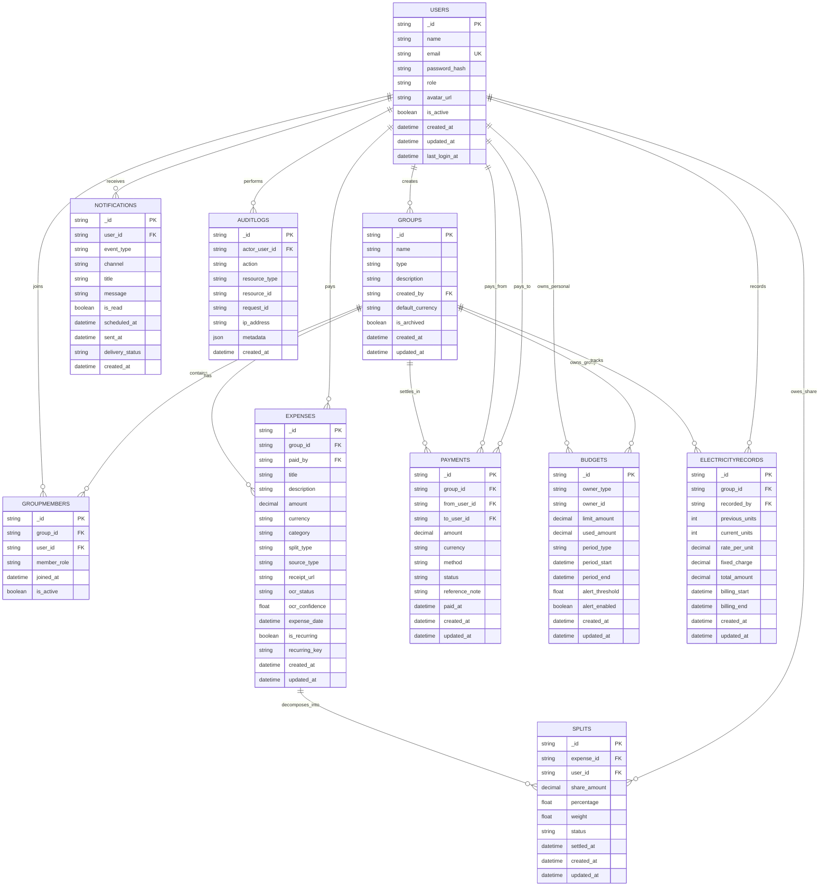

# ER Diagram — Spendez AI (MongoDB via Prisma)

## Entity Relationship Model

## Constraints and Validation Rules
- `USERS.email` must be unique and normalized.
- `GROUPMEMBERS (group_id, user_id)` composite unique constraint prevents duplicate memberships.
- `SPLITS.share_amount` values for an expense must sum to `EXPENSES.amount` (service-level invariant).
- `EXPENSES.amount`, `PAYMENTS.amount`, `BUDGETS.limit_amount` must be positive.
- `ELECTRICITYRECORDS.current_units >= previous_units`.
- `BUDGETS.owner_type` in (`USER`, `GROUP`) with conditional ownership validation.
- Soft-delete/archival flags for history-safe operations.

## Indexing Considerations (MongoDB + Prisma)
Recommended indexes:
- `USERS`: unique index on `email`
- `GROUPMEMBERS`: compound index on `(group_id, user_id)` unique; secondary on `user_id`
- `EXPENSES`: compound index on `(group_id, expense_date desc)`; index on `paid_by`; index on `recurring_key`
- `SPLITS`: compound index on `(expense_id, user_id)`
- `PAYMENTS`: compound index on `(group_id, paid_at desc)`
- `BUDGETS`: compound index on `(owner_type, owner_id, period_start)`
- `NOTIFICATIONS`: compound index on `(user_id, is_read, created_at desc)`
- `AUDITLOGS`: index on `(actor_user_id, created_at desc)` and `request_id`

## Transaction Boundaries
Use MongoDB transactions (where supported) for:
- Expense creation + split rows + audit log.
- Payment settlement + split status updates.
- Budget update + notification generation.

## Data Retention Notes
- Audit logs are append-only.
- Notifications and processed OCR metadata can be archived after policy threshold.
- Expense and payment records should remain immutable except controlled status transitions.
