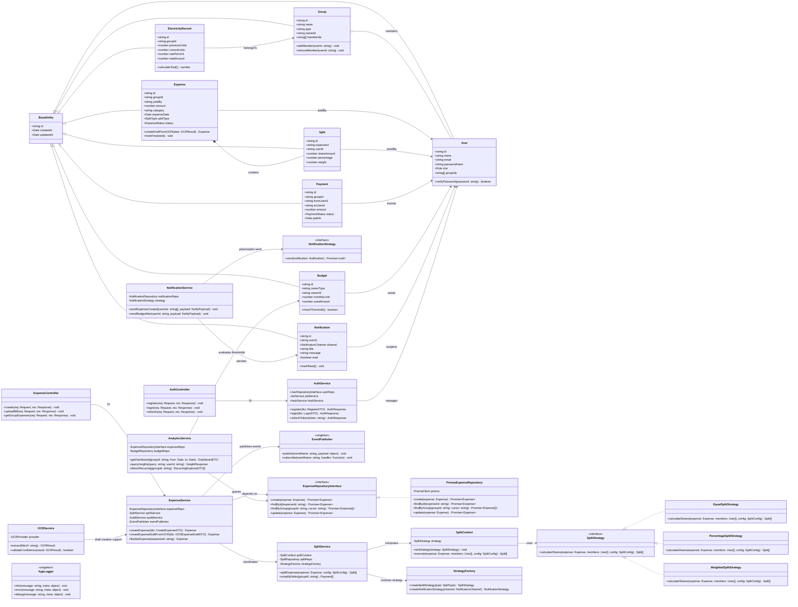

# Class Diagram — Spendez AI Backend (TypeScript)

## TypeScript-Oriented Modeling Notes
- Interfaces define repository and strategy contracts for strong type safety.
- DTOs (e.g., `CreateExpenseDTO`, `SplitConfig`, `InsightResponse`) prevent controller-service leakage.
- Dependency injection is used at controller/service construction to keep modules testable.
- Polymorphism is achieved by runtime strategy resolution via `StrategyFactory` and interface references.
