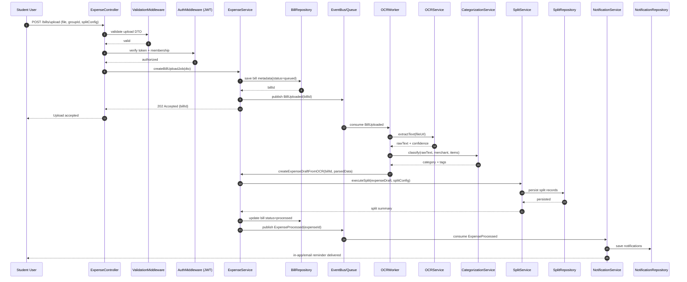
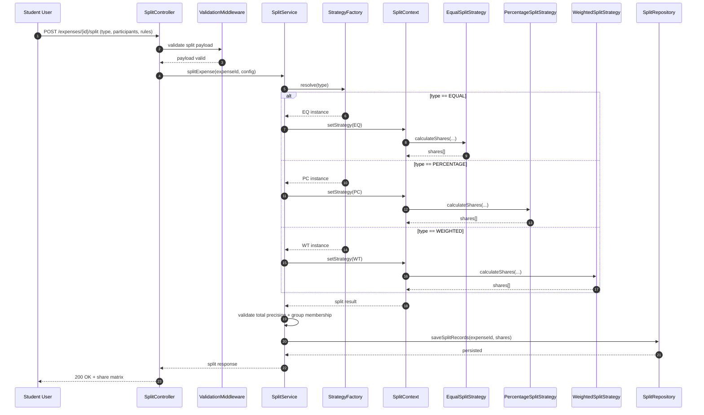
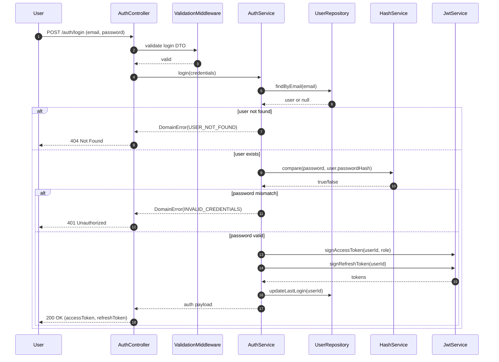
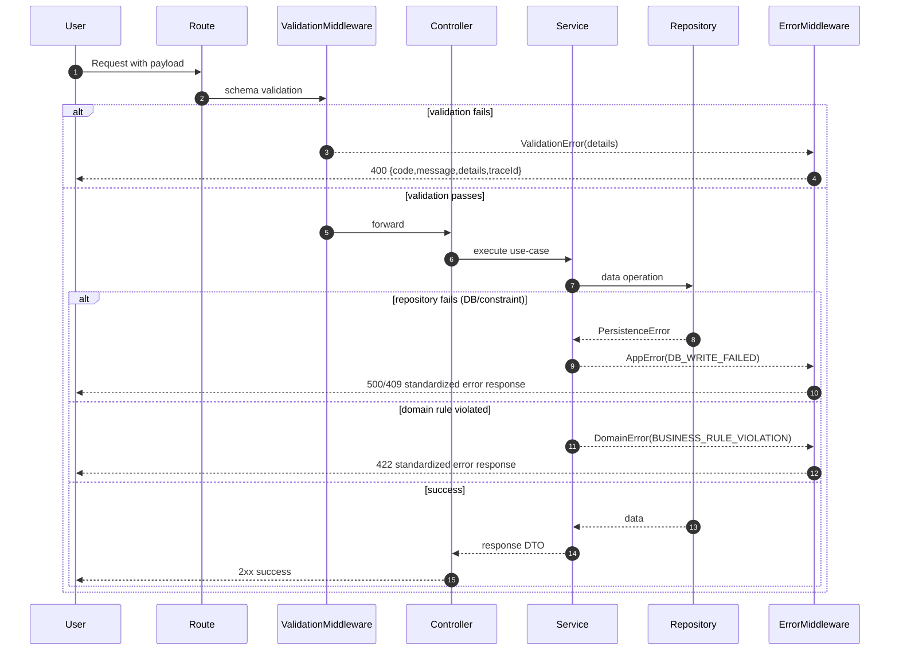
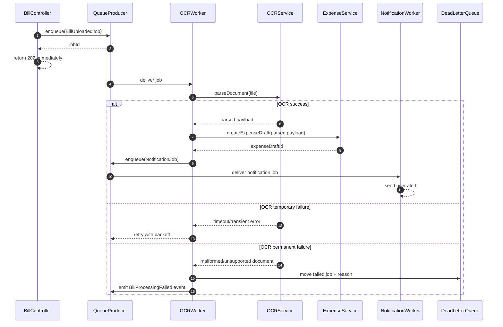

# Sequence Diagrams — Spendez AI

## A) Bill Upload -> OCR -> Categorization -> Split -> Notify

## B) Smart Split Strategy Execution Flow

## C) User Authentication Flow

## D) Error Handling & Validation Flow

## E) Async Processing Flow for OCR

