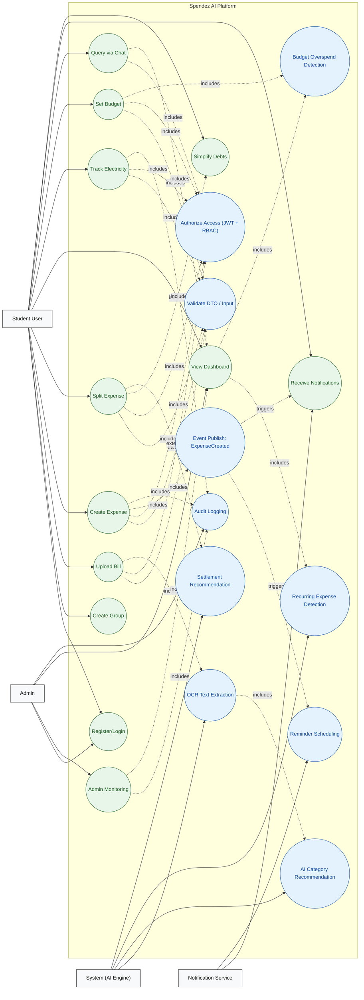

# Use Case Diagram — Spendez AI

```mermaid
flowchart LR
    %% Actors
    Student["Student User"]
    Admin["Admin"]
    AI["System (AI Engine)"]
    Notify["Notification Service"]

    %% System boundary
    subgraph System["Spendez AI Platform"]
        UC1(("Register/Login"))
        UC2(("Create Group"))
        UC3(("Upload Bill"))
        UC4(("Create Expense"))
        UC5(("Split Expense"))
        UC6(("View Dashboard"))
        UC7(("Track Electricity"))
        UC8(("Set Budget"))
        UC9(("Query via Chat"))
        UC10(("Receive Notifications"))
        UC11(("Simplify Debts"))
        UC12(("Admin Monitoring"))

        UC13(("Validate DTO / Input"))
        UC14(("Authorize Access (JWT + RBAC)"))
        UC15(("OCR Text Extraction"))
        UC16(("AI Category Recommendation"))
        UC17(("Recurring Expense Detection"))
        UC18(("Budget Overspend Detection"))
        UC19(("Event Publish: ExpenseCreated"))
        UC20(("Audit Logging"))
        UC21(("Settlement Recommendation"))
        UC22(("Reminder Scheduling"))
    end

    %% Student interactions
    Student --> UC1
    Student --> UC2
    Student --> UC3
    Student --> UC4
    Student --> UC5
    Student --> UC6
    Student --> UC7
    Student --> UC8
    Student --> UC9
    Student --> UC10
    Student --> UC11

    %% Admin interactions
    Admin --> UC1
    Admin --> UC12
    Admin --> UC6
    Admin --> UC20

    %% AI interactions
    AI --> UC15
    AI --> UC16
    AI --> UC17
    AI --> UC21

    %% Notification interactions
    Notify --> UC10
    Notify --> UC22

    %% Include/extend relationships
    UC3 -. includes .-> UC13
    UC3 -. includes .-> UC14
    UC3 -. includes .-> UC15
    UC15 -. includes .-> UC16

    UC4 -. includes .-> UC13
    UC4 -. includes .-> UC14
    UC4 -. includes .-> UC19
    UC4 -. includes .-> UC20

    UC5 -. includes .-> UC13
    UC5 -. includes .-> UC14
    UC5 -. includes .-> UC11
    UC5 -. extends .-> UC21

    UC7 -. includes .-> UC13
    UC7 -. includes .-> UC14
    UC7 -. includes .-> UC20

    UC8 -. includes .-> UC13
    UC8 -. includes .-> UC14
    UC8 -. includes .-> UC18

    UC6 -. includes .-> UC17
    UC6 -. includes .-> UC18

    UC9 -. includes .-> UC14
    UC9 -. includes .-> UC6

    UC19 -. triggers .-> UC22
    UC19 -. triggers .-> UC10

    UC12 -. includes .-> UC20
    UC12 -. includes .-> UC6

    %% Visual categorization
    classDef actor fill:#f8f9fa,stroke:#111,stroke-width:1px,color:#111;
    classDef usecase fill:#e8f5e9,stroke:#1b5e20,stroke-width:1px,color:#1b5e20;
    classDef internal fill:#e3f2fd,stroke:#0d47a1,stroke-width:1px,color:#0d47a1;

    class Student,Admin,AI,Notify actor;
    class UC1,UC2,UC3,UC4,UC5,UC6,UC7,UC8,UC9,UC10,UC11,UC12 usecase;
    class UC13,UC14,UC15,UC16,UC17,UC18,UC19,UC20,UC21,UC22 internal;
```
